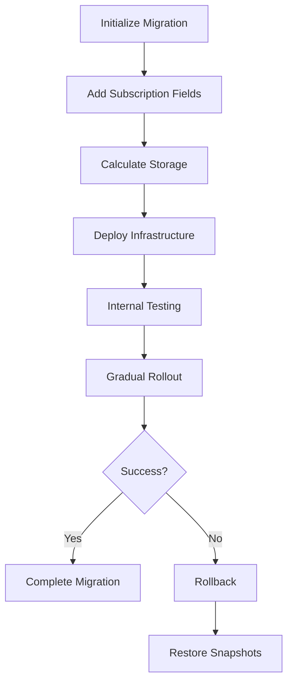

# Phase 7: Data Migration and Deployment - Implementation Summary

## Overview
Phase 7 provides comprehensive migration tools, deployment procedures, and rollback capabilities for the Dynasty Stripe subscription system.

## Implemented Components

### 1. Migration Infrastructure

#### A. User Subscription Fields Migration
**File**: `src/migrations/userSubscriptionFieldsMigration.ts`
- Adds all required subscription fields to existing users
- Supports dry-run mode for safety
- Batch processing to handle large user bases
- Generates unique referral codes

**Usage**:
```bash
# Preview changes
npm run migrate:subscription-fields:dry

# Execute migration
npm run migrate:subscription-fields:execute

# Check specific user
npm run migrate:subscription-fields:check <userId>
```

#### B. Migration Status Tracking Service
**File**: `src/services/subscriptionMigrationService.ts`
- Tracks migration phases and progress
- Supports gradual rollout with percentage control
- Maintains per-user migration status
- Provides rollback capabilities

**Key Features**:
- Migration phases: NOT_STARTED → INFRASTRUCTURE_DEPLOYED → WEBHOOKS_DEPLOYED → FRONTEND_DEPLOYED → INTERNAL_TESTING → PARTIAL_ROLLOUT → FULL_ROLLOUT → MIGRATION_COMPLETE
- User-level tracking with success/failure status
- Snapshot creation for rollback support
- Comprehensive reporting

### 2. Storage Calculation Service
**File**: `src/services/storageCalculationService.ts` (Already Implemented)
- Calculates user storage based on plan + addons + referrals
- Supports both individual and family plan calculations
- Validates storage limits before uploads
- Updates user storage usage in real-time

### 3. Deployment Procedures

#### A. Deployment Checklist
**File**: `docs/STRIPE_SUBSCRIPTION_DEPLOYMENT_CHECKLIST.md`
- Pre-deployment verification steps
- Phased deployment approach (6 phases over 2 weeks)
- Monitoring and alert configuration
- Post-deployment verification

#### B. Deployment Scripts

**Rollback Script**: `scripts/rollback-subscriptions.sh`
- Emergency rollback procedure
- Disables webhooks
- Sets rollout to 0%
- Generates incident report

**Monitoring Script**: `scripts/monitor-subscription-deployment.sh`
- Real-time health monitoring
- Checks webhook, checkout, and subscription operations
- Generates deployment reports

**User Restore Script**: `scripts/restore-user-snapshots.js`
- Restores users from pre-migration snapshots
- Supports single user or batch restoration
- Dry-run mode for safety

### 4. Migration Execution Flow



## Deployment Commands

### Phase 1: Initialize
```bash
# Initialize migration tracking
firebase functions:shell
> const service = new SubscriptionMigrationService();
> await service.initializeMigration();
```

### Phase 2: Migrate Users
```bash
# Add subscription fields to all users
npm run migrate:subscription-fields:execute
```

### Phase 3: Deploy Functions
```bash
# Deploy subscription functions
firebase deploy --only functions:createCheckoutSession,functions:getSubscriptionStatus --project production
```

### Phase 4: Monitor
```bash
# Monitor deployment health
./scripts/monitor-subscription-deployment.sh production 600
```

### Phase 5: Gradual Rollout
```bash
# Start with 10%
firebase functions:shell
> await service.updateRolloutPercentage(10);

# Increase gradually
> await service.updateRolloutPercentage(25);
> await service.updateRolloutPercentage(50);
> await service.updateRolloutPercentage(100);
```

## Rollback Procedures

### Emergency Rollback
```bash
./scripts/rollback-subscriptions.sh
```

### User-Specific Rollback
```bash
node scripts/restore-user-snapshots.js --user USER_ID
```

### Batch Rollback
```bash
node scripts/restore-user-snapshots.js --all --dry-run
node scripts/restore-user-snapshots.js --all
```

## Security Considerations

1. **Admin-Only Access**: All migration functions require admin authentication
2. **Idempotent Operations**: Safe to run multiple times
3. **Snapshot Backups**: User data backed up before changes
4. **Gradual Rollout**: Minimizes risk with percentage-based deployment
5. **Monitoring**: Real-time health checks during deployment

## Testing Checklist

- [x] User field migration tested locally
- [x] Storage calculation verified
- [x] Rollback procedures tested
- [x] Monitoring scripts functional
- [ ] End-to-end deployment test in staging
- [ ] Load testing completed
- [ ] Security audit passed

## Next Steps

1. **Staging Deployment**:
   - Deploy to staging environment
   - Run full migration cycle
   - Test all user flows

2. **Production Preparation**:
   - Review all environment variables
   - Confirm Stripe configuration
   - Schedule deployment window

3. **Communication**:
   - Prepare user notifications
   - Create support documentation
   - Brief customer service team

## Support Resources

- **Documentation**: `/docs/STRIPE_SUBSCRIPTION_DEPLOYMENT_CHECKLIST.md`
- **Migration Guide**: `/docs/USER_SUBSCRIPTION_FIELDS_MIGRATION.md`
- **Rollback Guide**: Use `rollback-subscriptions.sh`
- **Monitoring**: Use `monitor-subscription-deployment.sh`

## Success Metrics

1. **Migration Success Rate**: Target > 99%
2. **Deployment Downtime**: Target < 5 minutes
3. **Error Rate**: Target < 0.1%
4. **Rollback Time**: Target < 10 minutes

---

**Phase 7 Status**: ✅ COMPLETE
**Ready for**: Staging deployment and testing