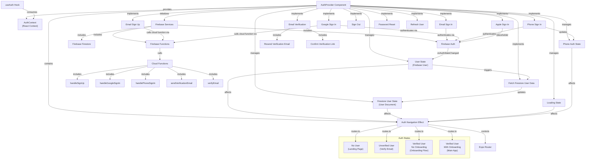

```mermaid
graph TD
    %% Main Components
    AuthContext["AuthContext<br/>(React Context)"]
    AuthProvider["AuthProvider Component"]
    useAuth["useAuth Hook"]

    %% Firebase Services
    Firebase["Firebase Services"]
    FirebaseAuth["Firebase Auth"]
    FirebaseFirestore["Firebase Firestore"]
    FirebaseFunctions["Firebase Functions"]

    %% Auth States
    UserState["User State<br/>(Firebase User)"]
    FirestoreUserState["Firestore User State<br/>(User Document)"]
    LoadingState["Loading State"]
    PhoneAuthState["Phone Auth State"]

    %% Authentication Methods
    EmailSignIn["Email Sign In"]
    EmailSignUp["Email Sign Up"]
    GoogleSignIn["Google Sign In"]
    PhoneSignIn["Phone Sign In"]
    AppleSignIn["Apple Sign In"]
    SignOut["Sign Out"]

    %% Email Verification
    EmailVerification["Email Verification"]
    ResendVerification["Resend Verification Email"]
    ConfirmVerification["Confirm Verification Link"]

    %% Password Management
    PasswordReset["Password Reset"]

    %% Navigation Control
    AuthNavEffect["Auth Navigation Effect"]
    Router["Expo Router"]

    %% User Data Management
    RefreshUser["Refresh User"]
    FetchFirestoreData["Fetch Firestore User Data"]

    %% Relationships
    AuthProvider -->|provides| AuthContext
    useAuth -->|consumes| AuthContext

    AuthProvider -->|initializes| Firebase
    Firebase -->|includes| FirebaseAuth
    Firebase -->|includes| FirebaseFirestore
    Firebase -->|includes| FirebaseFunctions

    AuthProvider -->|manages| UserState
    AuthProvider -->|manages| FirestoreUserState
    AuthProvider -->|manages| LoadingState
    AuthProvider -->|manages| PhoneAuthState

    AuthProvider -->|implements| EmailSignIn
    AuthProvider -->|implements| EmailSignUp
    AuthProvider -->|implements| GoogleSignIn
    AuthProvider -->|implements| PhoneSignIn
    AuthProvider -->|implements| AppleSignIn
    AuthProvider -->|implements| SignOut

    AuthProvider -->|implements| EmailVerification
    EmailVerification -->|includes| ResendVerification
    EmailVerification -->|includes| ConfirmVerification

    AuthProvider -->|implements| PasswordReset

    AuthProvider -->|contains| AuthNavEffect
    AuthNavEffect -->|controls| Router

    AuthProvider -->|implements| RefreshUser
    AuthProvider -->|implements| FetchFirestoreData

    %% Auth Flow
    FirebaseAuth -->|onAuthStateChanged| UserState
    UserState -->|triggers| FetchFirestoreData
    FetchFirestoreData -->|updates| FirestoreUserState

    %% Sign In/Up Flow
    EmailSignIn -->|authenticates via| FirebaseAuth
    EmailSignUp -->|calls cloud function via| FirebaseFunctions
    GoogleSignIn -->|authenticates via| FirebaseAuth
    GoogleSignIn -->|calls cloud function via| FirebaseFunctions
    PhoneSignIn -->|authenticates via| FirebaseAuth
    PhoneSignIn -->|updates| PhoneAuthState
    AppleSignIn -->|placeholder| FirebaseAuth

    %% Navigation Logic
    UserState -->|affects| AuthNavEffect
    FirestoreUserState -->|affects| AuthNavEffect
    LoadingState -->|affects| AuthNavEffect
    PhoneAuthState -->|affects| AuthNavEffect

    %% Cloud Functions
    CloudFunctions["Cloud Functions"]
    HandleSignUp["handleSignUp"]
    HandleGoogleSignIn["handleGoogleSignIn"]
    HandlePhoneSignIn["handlePhoneSignIn"]
    SendVerificationEmail["sendVerificationEmail"]
    VerifyEmail["verifyEmail"]

    FirebaseFunctions -->|calls| CloudFunctions
    CloudFunctions -->|includes| HandleSignUp
    CloudFunctions -->|includes| HandleGoogleSignIn
    CloudFunctions -->|includes| HandlePhoneSignIn
    CloudFunctions -->|includes| SendVerificationEmail
    CloudFunctions -->|includes| VerifyEmail

    %% Auth States
    subgraph "Auth States"
        NoUser["No User<br/>(Landing Page)"]
        UnverifiedUser["Unverified User<br/>(Verify Email)"]
        VerifiedNoOnboarding["Verified User<br/>No Onboarding<br/>(Onboarding Flow)"]
        VerifiedWithOnboarding["Verified User<br/>With Onboarding<br/>(Main App)"]
    end

    AuthNavEffect -->|routes to| NoUser
    AuthNavEffect -->|routes to| UnverifiedUser
    AuthNavEffect -->|routes to| VerifiedNoOnboarding
    AuthNavEffect -->|routes to| VerifiedWithOnboarding
```
