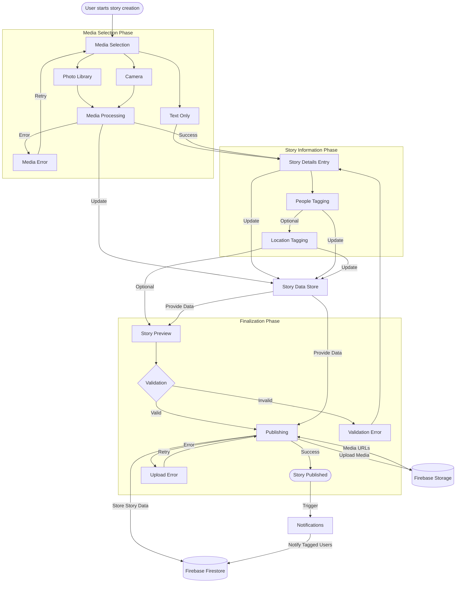

```mermaid
graph TD
    %% Main States
    Start([User starts story creation])
    MediaSelection[Media Selection]
    StoryDetails[Story Details Entry]
    PeopleTagging[People Tagging]
    LocationTagging[Location Tagging]
    Preview[Story Preview]
    Publishing[Publishing]
    Success([Story Published])

    %% Media Selection Options
    PhotoLibrary[Photo Library]
    Camera[Camera]
    Text[Text Only]

    %% Media Processing
    MediaProcessing[Media Processing]

    %% Validation
    Validation{Validation}

    %% Error States
    MediaError[Media Error]
    ValidationError[Validation Error]
    UploadError[Upload Error]

    %% Flow
    Start --> MediaSelection

    %% Media Selection Flow
    MediaSelection --> PhotoLibrary
    MediaSelection --> Camera
    MediaSelection --> Text

    PhotoLibrary --> MediaProcessing
    Camera --> MediaProcessing
    Text --> StoryDetails

    MediaProcessing -->|Success| StoryDetails
    MediaProcessing -->|Error| MediaError
    MediaError -->|Retry| MediaSelection

    %% Story Details Flow
    StoryDetails --> PeopleTagging

    %% People Tagging Flow
    PeopleTagging -->|Optional| LocationTagging

    %% Location Tagging Flow
    LocationTagging -->|Optional| Preview

    %% Preview Flow
    Preview --> Validation
    Validation -->|Valid| Publishing
    Validation -->|Invalid| ValidationError
    ValidationError --> StoryDetails

    %% Publishing Flow
    Publishing -->|Success| Success
    Publishing -->|Error| UploadError
    UploadError -->|Retry| Publishing

    %% Subgraphs for clarity
    subgraph "Media Selection Phase"
        MediaSelection
        PhotoLibrary
        Camera
        Text
        MediaProcessing
        MediaError
    end

    subgraph "Story Information Phase"
        StoryDetails
        PeopleTagging
        LocationTagging
    end

    subgraph "Finalization Phase"
        Preview
        Validation
        ValidationError
        Publishing
        UploadError
        Success
    end

    %% Data Flow
    StoryData[Story Data Store]

    MediaProcessing -->|Update| StoryData
    StoryDetails -->|Update| StoryData
    PeopleTagging -->|Update| StoryData
    LocationTagging -->|Update| StoryData
    StoryData -->|Provide Data| Preview
    StoryData -->|Provide Data| Publishing

    %% Backend Integration
    FirebaseStorage[(Firebase Storage)]
    FirebaseFirestore[(Firebase Firestore)]

    Publishing -->|Upload Media| FirebaseStorage
    FirebaseStorage -->|Media URLs| Publishing
    Publishing -->|Store Story Data| FirebaseFirestore

    %% User Notifications
    Notifications[Notifications]

    Success -->|Trigger| Notifications
    Notifications -->|Notify Tagged Users| FirebaseFirestore
```
