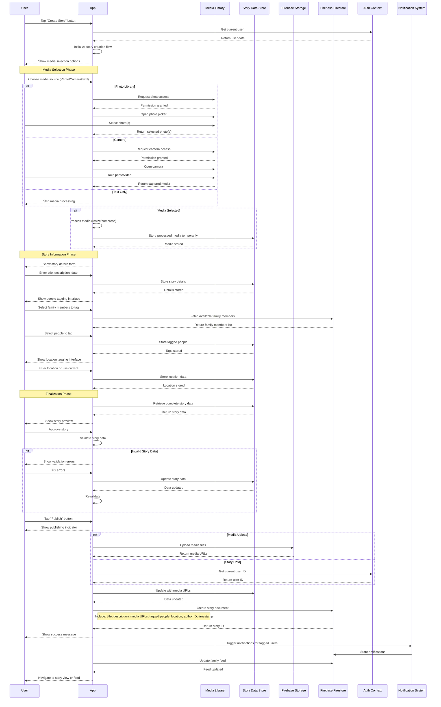

```mermaid
sequenceDiagram
    participant User
    participant App
    participant MediaLib as Media Library
    participant StoryStore as Story Data Store
    participant Storage as Firebase Storage
    participant Firestore as Firebase Firestore
    participant Auth as Auth Context
    participant Notif as Notification System

    %% Story Creation Initiation
    User->>App: Tap "Create Story" button
    App->>Auth: Get current user
    Auth-->>App: Return user data
    App->>App: Initialize story creation flow
    App-->>User: Show media selection options

    %% Media Selection
    Note over User,App: Media Selection Phase
    User->>App: Choose media source (Photo/Camera/Text)

    alt Photo Library
        App->>MediaLib: Request photo access
        MediaLib-->>App: Permission granted
        App->>MediaLib: Open photo picker
        User->>MediaLib: Select photo(s)
        MediaLib-->>App: Return selected photo(s)
    else Camera
        App->>MediaLib: Request camera access
        MediaLib-->>App: Permission granted
        App->>MediaLib: Open camera
        User->>MediaLib: Take photo/video
        MediaLib-->>App: Return captured media
    else Text Only
        App-->>User: Skip media processing
    end

    %% Media Processing
    alt Media Selected
        App->>App: Process media (resize/compress)
        App->>StoryStore: Store processed media temporarily
        StoryStore-->>App: Media stored
    end

    %% Story Details
    Note over User,App: Story Information Phase
    App-->>User: Show story details form
    User->>App: Enter title, description, date
    App->>StoryStore: Store story details
    StoryStore-->>App: Details stored

    %% People Tagging
    App-->>User: Show people tagging interface
    User->>App: Select family members to tag
    App->>Firestore: Fetch available family members
    Firestore-->>App: Return family members list
    User->>App: Select people to tag
    App->>StoryStore: Store tagged people
    StoryStore-->>App: Tags stored

    %% Location Tagging
    App-->>User: Show location tagging interface
    User->>App: Enter location or use current
    App->>StoryStore: Store location data
    StoryStore-->>App: Location stored

    %% Preview
    Note over User,App: Finalization Phase
    App->>StoryStore: Retrieve complete story data
    StoryStore-->>App: Return story data
    App-->>User: Show story preview
    User->>App: Approve story

    %% Validation
    App->>App: Validate story data

    alt Invalid Story Data
        App-->>User: Show validation errors
        User->>App: Fix errors
        App->>StoryStore: Update story data
        StoryStore-->>App: Data updated
        App->>App: Revalidate
    end

    %% Publishing
    User->>App: Tap "Publish" button
    App-->>User: Show publishing indicator

    par Media Upload
        App->>Storage: Upload media files
        Storage-->>App: Return media URLs
    and Story Data
        App->>Auth: Get current user ID
        Auth-->>App: Return user ID
    end

    App->>StoryStore: Update with media URLs
    StoryStore-->>App: Data updated

    App->>Firestore: Create story document
    Note right of App: Include: title, description, media URLs, tagged people, location, author ID, timestamp
    Firestore-->>App: Return story ID

    %% Success and Notifications
    App-->>User: Show success message
    App->>Notif: Trigger notifications for tagged users
    Notif->>Firestore: Store notifications

    %% Feed Update
    App->>Firestore: Update family feed
    Firestore-->>App: Feed updated

    %% Final
    App-->>User: Navigate to story view or feed
```
