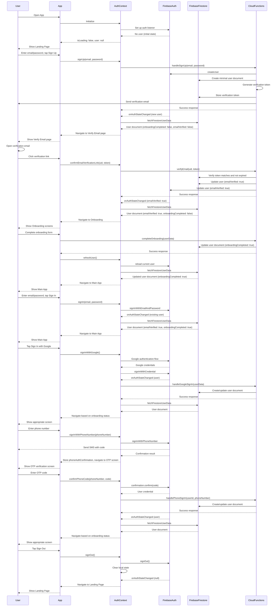

```mermaid
sequenceDiagram
    participant User
    participant App
    participant AuthContext
    participant FirebaseAuth
    participant FirebaseFirestore
    participant CloudFunctions

    %% Initial App Load
    User->>App: Open App
    App->>AuthContext: Initialize
    AuthContext->>FirebaseAuth: Set up auth listener
    FirebaseAuth-->>AuthContext: No user (initial state)
    AuthContext-->>App: isLoading: false, user: null
    App-->>User: Show Landing Page

    %% Email Sign Up Flow
    User->>App: Enter email/password, tap Sign Up
    App->>AuthContext: signUp(email, password)
    AuthContext->>CloudFunctions: handleSignUp(email, password)
    CloudFunctions->>FirebaseAuth: createUser
    CloudFunctions->>FirebaseFirestore: Create minimal user document
    CloudFunctions->>CloudFunctions: Generate verification token
    CloudFunctions->>FirebaseFirestore: Store verification token
    CloudFunctions->>User: Send verification email
    CloudFunctions-->>AuthContext: Success response
    FirebaseAuth-->>AuthContext: onAuthStateChanged (new user)
    AuthContext->>FirebaseFirestore: fetchFirestoreUserData
    FirebaseFirestore-->>AuthContext: User document (onboardingCompleted: false, emailVerified: false)
    AuthContext-->>App: Navigate to Verify Email page
    App-->>User: Show Verify Email page

    %% Email Verification Flow
    User->>User: Open verification email
    User->>App: Click verification link
    App->>AuthContext: confirmEmailVerificationLink(uid, token)
    AuthContext->>CloudFunctions: verifyEmail(uid, token)
    CloudFunctions->>FirebaseFirestore: Verify token matches and not expired
    CloudFunctions->>FirebaseFirestore: Update user (emailVerified: true)
    CloudFunctions->>FirebaseAuth: Update user (emailVerified: true)
    CloudFunctions-->>AuthContext: Success response
    FirebaseAuth-->>AuthContext: onAuthStateChanged (emailVerified: true)
    AuthContext->>FirebaseFirestore: fetchFirestoreUserData
    FirebaseFirestore-->>AuthContext: User document (emailVerified: true, onboardingCompleted: false)
    AuthContext-->>App: Navigate to Onboarding
    App-->>User: Show Onboarding screens

    %% Onboarding Flow
    User->>App: Complete onboarding form
    App->>CloudFunctions: completeOnboarding(userData)
    CloudFunctions->>FirebaseFirestore: Update user document (onboardingCompleted: true)
    CloudFunctions-->>App: Success response
    App->>AuthContext: refreshUser()
    AuthContext->>FirebaseAuth: reload current user
    AuthContext->>FirebaseFirestore: fetchFirestoreUserData
    FirebaseFirestore-->>AuthContext: Updated user document (onboardingCompleted: true)
    AuthContext-->>App: Navigate to Main App
    App-->>User: Show Main App

    %% Sign In Flow (Existing User)
    User->>App: Enter email/password, tap Sign In
    App->>AuthContext: signIn(email, password)
    AuthContext->>FirebaseAuth: signInWithEmailAndPassword
    FirebaseAuth-->>AuthContext: onAuthStateChanged (existing user)
    AuthContext->>FirebaseFirestore: fetchFirestoreUserData
    FirebaseFirestore-->>AuthContext: User document (emailVerified: true, onboardingCompleted: true)
    AuthContext-->>App: Navigate to Main App
    App-->>User: Show Main App

    %% Google Sign In Flow
    User->>App: Tap Sign In with Google
    App->>AuthContext: signInWithGoogle()
    AuthContext->>FirebaseAuth: Google authentication flow
    FirebaseAuth-->>AuthContext: Google credentials
    AuthContext->>FirebaseAuth: signInWithCredential
    FirebaseAuth-->>AuthContext: onAuthStateChanged (user)
    AuthContext->>CloudFunctions: handleGoogleSignIn(userData)
    CloudFunctions->>FirebaseFirestore: Create/update user document
    CloudFunctions-->>AuthContext: Success response
    AuthContext->>FirebaseFirestore: fetchFirestoreUserData
    FirebaseFirestore-->>AuthContext: User document
    AuthContext-->>App: Navigate based on onboarding status
    App-->>User: Show appropriate screen

    %% Phone Sign In Flow
    User->>App: Enter phone number
    App->>AuthContext: signInWithPhoneNumber(phoneNumber)
    AuthContext->>FirebaseAuth: signInWithPhoneNumber
    FirebaseAuth-->>User: Send SMS with code
    FirebaseAuth-->>AuthContext: Confirmation result
    AuthContext-->>App: Store phoneAuthConfirmation, navigate to OTP screen
    App-->>User: Show OTP verification screen
    User->>App: Enter OTP code
    App->>AuthContext: confirmPhoneCode(phoneNumber, code)
    AuthContext->>FirebaseAuth: confirmation.confirm(code)
    FirebaseAuth-->>AuthContext: User credential
    AuthContext->>CloudFunctions: handlePhoneSignIn(userId, phoneNumber)
    CloudFunctions->>FirebaseFirestore: Create/update user document
    CloudFunctions-->>AuthContext: Success response
    FirebaseAuth-->>AuthContext: onAuthStateChanged (user)
    AuthContext->>FirebaseFirestore: fetchFirestoreUserData
    FirebaseFirestore-->>AuthContext: User document
    AuthContext-->>App: Navigate based on onboarding status
    App-->>User: Show appropriate screen

    %% Sign Out Flow
    User->>App: Tap Sign Out
    App->>AuthContext: signOut()
    AuthContext->>FirebaseAuth: signOut()
    AuthContext->>AuthContext: Clear local state
    FirebaseAuth-->>AuthContext: onAuthStateChanged (null)
    AuthContext-->>App: Navigate to Landing Page
    App-->>User: Show Landing Page
```
