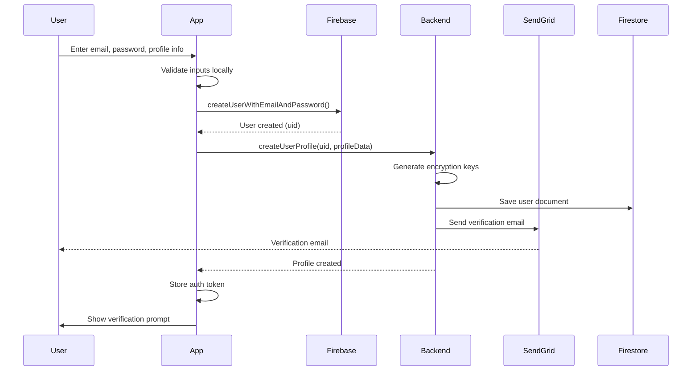
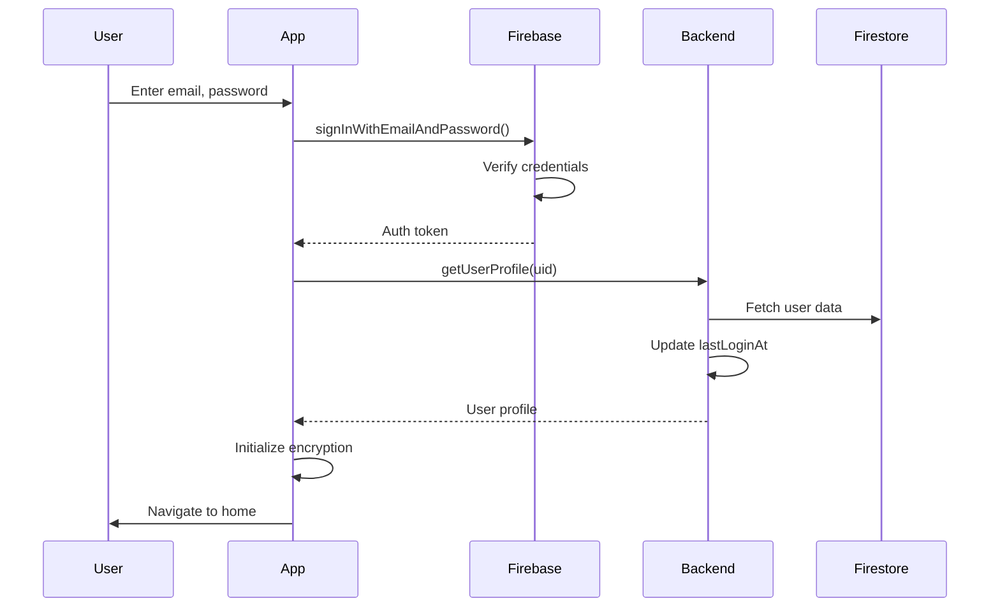
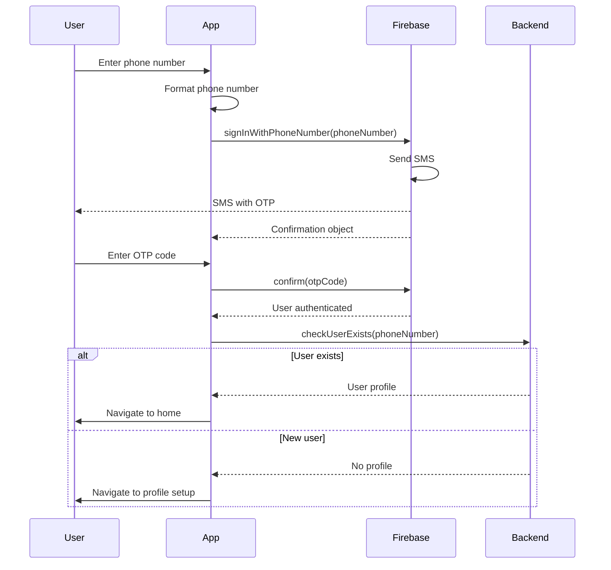
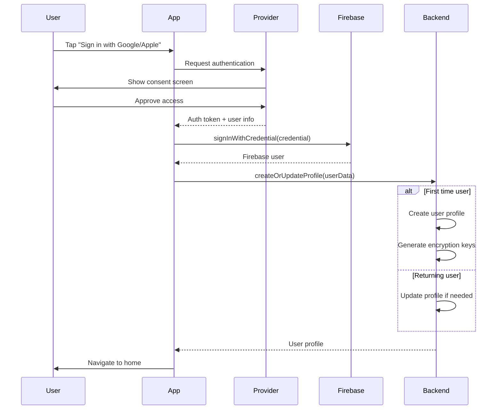
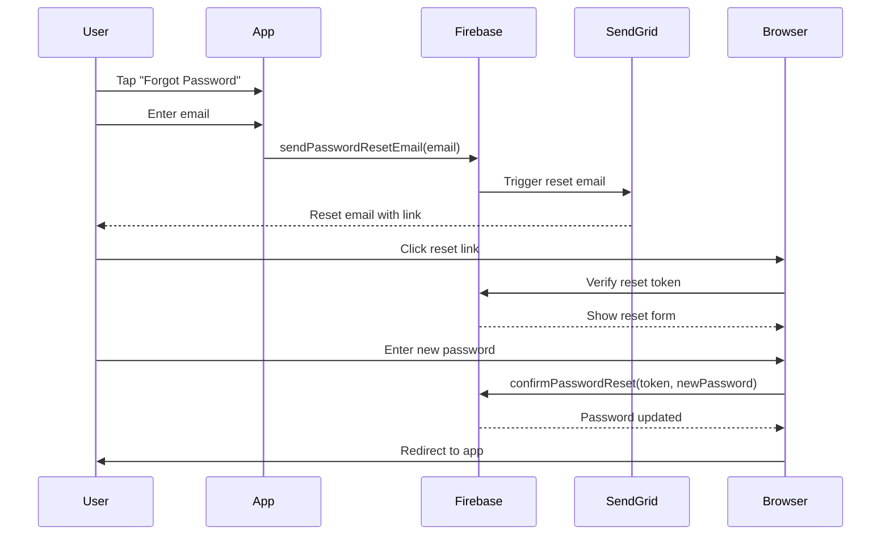
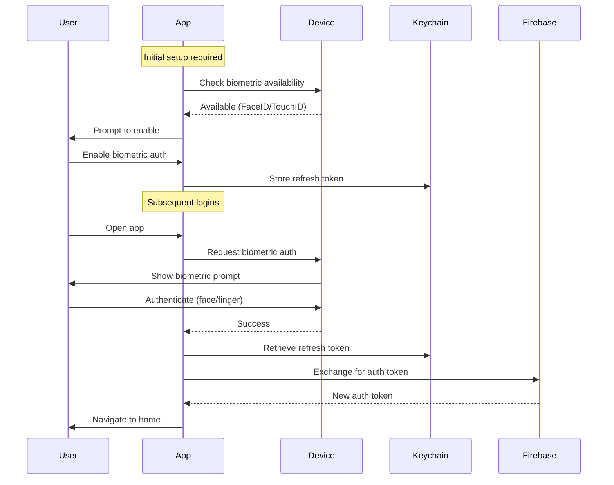
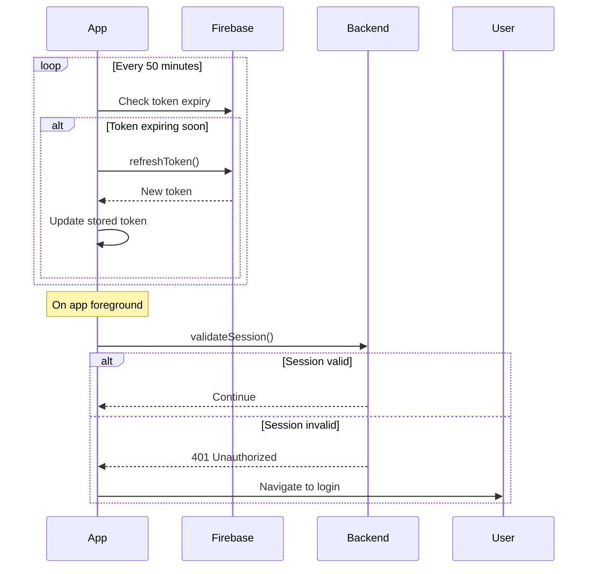
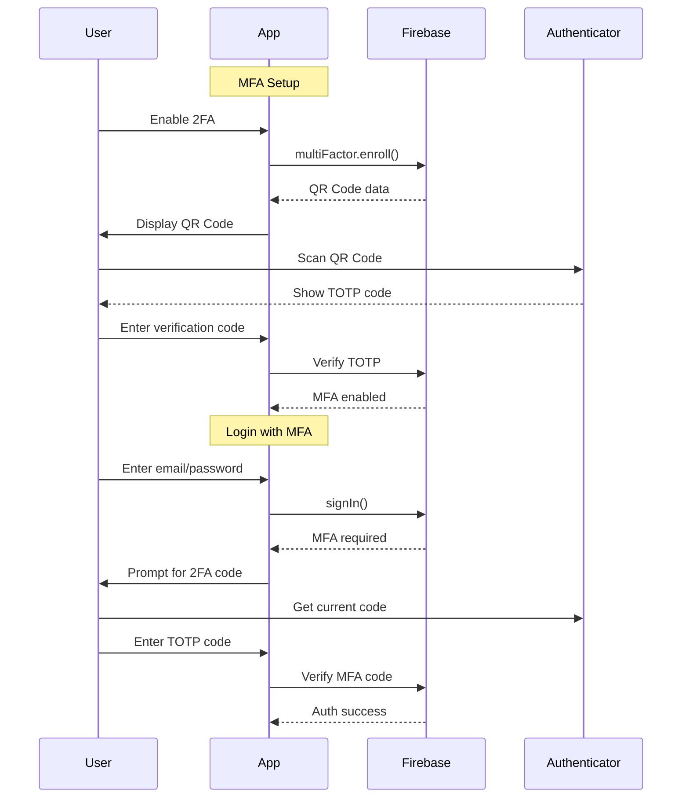

# Authentication Flows

This document details the authentication flows used in Dynasty across different scenarios.

## Email/Password Sign Up Flow

## Email/Password Sign In Flow

## Phone Authentication Flow

## Social Authentication Flow (Google/Apple)

## Password Reset Flow

## Biometric Authentication Flow

## Session Management Flow

## Multi-Factor Authentication Flow

## Security Considerations

### Token Storage
- **Mobile**: iOS Keychain / Android Keystore
- **Web**: HttpOnly secure cookies
- **Never store in**: LocalStorage, AsyncStorage (unencrypted)

### Session Security
- Tokens expire after 1 hour
- Refresh tokens rotated on use
- Device binding for sensitive operations
- Logout clears all tokens

### Network Security
- All auth requests over HTTPS
- Certificate pinning on mobile
- Request signing for sensitive operations

### Error Handling
- Generic error messages to users
- Detailed logging server-side only
- Rate limiting on all auth endpoints
- Account lockout after failed attempts

## Implementation Notes

### Mobile Considerations
- Handle app suspension/resume
- Biometric prompt on app open
- Offline token validation
- Background token refresh

-### Web Considerations
- Secure cookie configuration
- SSR session validation
- Cross-tab session sync

### Backend Considerations
- Stateless authentication
- Token validation caching
- Audit logging
- Anomaly detection